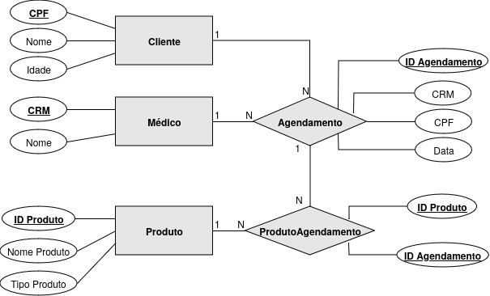

# Trabalho final de PCS3623

Esse repositório é uma aplicação web funcional, escrita utilizando o framework [FastAPI](https://fastapi.tiangolo.com/) para a linguagem Python, além do ORM [SQLModel](https://sqlmodel.tiangolo.com/). Há um frontend bem cru feito a partir do [React](https://react.dev/).

Consiste em um conjunto de 5 telas CRUD, representando telas de mock, para manipulação do banco de dados. A aplicação representa um banco de dados bem simplificado de um sistema hospitalar de agendamento de consultas e exames.

## Executando o projeto

Ao invés de usar um sistema de build complexo, optei por utilizar um [justfile](https://github.com/casey/just). Além disso, para gestão de dependências, o projeto usa o [nix](https://nixos.org/download/https://nixos.org/download/).

### Dependências

1. Instale o [just](https://github.com/casey/just)
2. Instale o [nix](https://nixos.org/download/https://nixos.org/download/)
3. Dentro do projeto, execute `nix develop`. Ao final do processo, tanto o Python quanto suas bibliotecas estarão instaladas, bem como o Node.
4. Instale as dependências do Node:

```bash
npm install
```

### Iniciando a aplicação

Estando dentro do projeto, execute a receita `run`

```bash
just run
```

Automaticamente seu navegador deve abrir no endereço [localhost:3000](localhost:3000), e a aplicação está pronta

## Diagrama Entidade-Relacionamento


